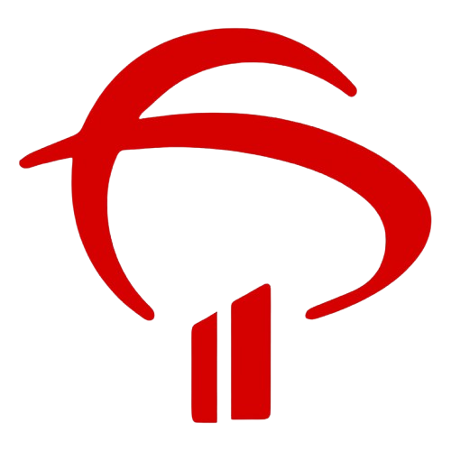

#   Fundação Bradesco • 2019

### Certificações de 2019

Abaixo estão listados os cursos concluídos nesta instituição durante o ano de 2019. Clique em **Visualizar Comprovante** para abrir o certificado em PDF.

| Curso / Certificação | Instituição | Conclusão | Comprovante |
| :--- | :--- | :---: | :---: |
| **Empreendedorismo e Inovação** | Fundação Bradesco | 26/06/2019 | [🌐 Visualizar Certificado](https://github.com/stefanymazzei/stefanymazzei/blob/main/docs/certificados/fundacao-bradesco/Empreendedorismo%20e%20Inova%C3%A7%C3%A3o%20(Funda%C3%A7%C3%A3o%20Bradesco).pdf) |
| **Introdução à Administração** | Fundação Bradesco | 17/07/2019 | [🌐 Visualizar Certificado](../../../docs/certificados/fundacao-bradesco/Introdu%C3%A7%C3%A3o%20%C3%A0%20Administra%C3%A7%C3%A3o%20(Funda%C3%A7%C3%A3o%20Bradesco).pdf) |

---

[← Voltar para Instituições](../certificacoes.md) | [🌐 Início](https://github.com/stefanymazzei)
