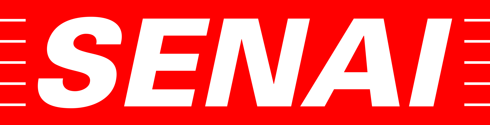
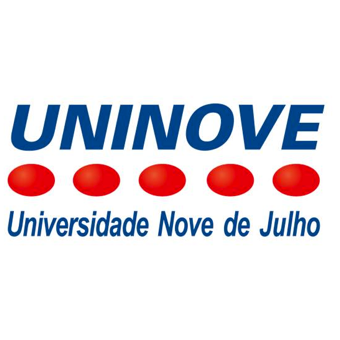

# 📜 Certificações & Qualificações

Selecione a instituição de ensino e o ano correspondente para visualizar os certificados obtidos no período:

---

<table align="center">
  <!-- 1. Linha com os Logos das Instituições -->
  <tr align="center">
    <th width="33%">
      
    </th>
    <th width="33%">
      
    </th>
    <th width="33%">
      
    </th>
  </tr>

  <!-- 2. Linha com os Títulos das Instituições -->
  <tr align="center">
    <td><b>Fundação Bradesco</b></td>
    <td><b>SENAI</b></td>
    <td><b>UNINOVE</b></td>
  </tr>

  <!-- 3. Linha com os Anos e Links de Acesso -->
  <tr align="center" valign="top">
    <td>
       
      <a href="./2026-fundacao.md">📂 <b>2026</b></a>  
      <a href="./2025-fundacao.md">📂 <b>2025</b></a>  
      <a href="./2024-fundacao.md">📂 <b>2024</b></a>  
      <a href="./2021-fundacao.md">📂 <b>2021</b></a>  
      <a href="./2020-fundacao.md">📂 <b>2020</b></a>  
      <a href="./2019-fundacao.md">📂 <b>2019</b></a>
    </td>
    <td>
       
      <a href="../mds/2026-senai.md">📂 <b>2026</b></a>
    </td>
    <td>
       
      <a href="../mds/2025-uninove.md">📂 <b>2025</b></a>  
      <a href="../mds/2024-uninove.md">📂 <b>2024</b></a>
    </td>
  </tr>
</table>

---

[⬅️ Voltar ao Perfil Principal](https://github.com/stefanymazzei)
