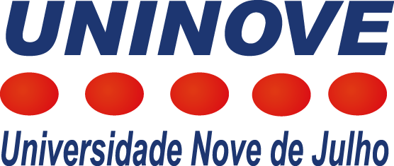

#  Universidade Nove de Julho • 2026

### Bacharel/Tecnólogo

Abaixo estão listados os cursos concluídos nesta instituição iniciados em 2024 e 2025. Clique em **Visualizar Comprovante** para abrir o certificado em PDF.

| Curso / Certificação | Instituição | Conclusão | Comprovante/Atestado de Matrícula |
| :--- | :--- | :---: | :---: |
| **Análise e Desenvolvimento de Sistemas** | Uninove | 15/12/2027 - Em andamento | [📃 Visualizar Declaração](https://github.com/stefanymazzei/stefanymazzei/blob/main/docs/certificados/uninove/Atestado%20de%20Matr%C3%ADcula%20(ADS)_page-0001.jpg) |
| **Administração Empresarial** | Uninove | 15/07/2028 - Em andamento | [📃 Visualizar Declaração](https://github.com/stefanymazzei/stefanymazzei/blob/main/docs/certificados/uninove/Atestado%20de%20Matr%C3%ADcula%20(Administra%C3%A7%C3%A3o)_page-0001.jpg) |

---

[⬅️ Voltar para Instituições](./certificacoes.md) | [🌐 Início](https://github.com/stefanymazzei)
